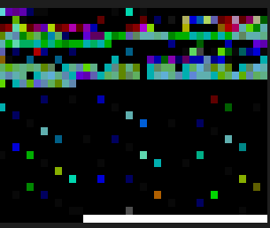

# C: object and shared object files



```
$ file main.o
main.o: ELF 64-bit LSB relocatable, x86-64, version 1 (SYSV), not stripped
```

There is a separate strip(1) command to discard symbols and other data from object files.

> https://stackoverflow.com/questions/3880924/how-to-view-symbols-in-object-files

```
$ objdump -t main.o

main.o:     file format elf64-x86-64

SYMBOL TABLE:
0000000000000000 l    df *ABS*  0000000000000000 main.c
0000000000000000 l    d  .text  0000000000000000 .text
0000000000000000 l    d  .rodata    0000000000000000 .rodata
0000000000000000 g     F .text  000000000000002e print_name
0000000000000000         *UND*  0000000000000000 printf
```

There are symbol and dynamic symbol tables. More headers.

Notes: `l` local, `g` global, address (all zero for filename and sections),
size (all zero for sections); size of `print_name` is 2e, 46 bytes.

```
$ objdump -x main.o

main.o:     file format elf64-x86-64
main.o
architecture: i386:x86-64, flags 0x00000011:
HAS_RELOC, HAS_SYMS
start address 0x0000000000000000

Sections:
Idx Name          Size      VMA               LMA               File off  Algn
  0 .text         0000002e  0000000000000000  0000000000000000  00000040  2**0
                  CONTENTS, ALLOC, LOAD, RELOC, READONLY, CODE
  1 .data         00000000  0000000000000000  0000000000000000  0000006e  2**0
                  CONTENTS, ALLOC, LOAD, DATA
  2 .bss          00000000  0000000000000000  0000000000000000  0000006e  2**0
                  ALLOC
  3 .rodata       0000000f  0000000000000000  0000000000000000  0000006e  2**0
                  CONTENTS, ALLOC, LOAD, READONLY, DATA
  4 .comment      0000002c  0000000000000000  0000000000000000  0000007d  2**0
                  CONTENTS, READONLY
  5 .note.GNU-stack 00000000  0000000000000000  0000000000000000  000000a9  2**0
                  CONTENTS, READONLY
  6 .note.gnu.property 00000020  0000000000000000  0000000000000000  000000b0  2**3
                  CONTENTS, ALLOC, LOAD, READONLY, DATA
  7 .eh_frame     00000038  0000000000000000  0000000000000000  000000d0  2**3
                  CONTENTS, ALLOC, LOAD, RELOC, READONLY, DATA
SYMBOL TABLE:
0000000000000000 l    df *ABS*  0000000000000000 main.c
0000000000000000 l    d  .text  0000000000000000 .text
0000000000000000 l    d  .rodata        0000000000000000 .rodata
0000000000000000 g     F .text  000000000000002e print_name
0000000000000000         *UND*  0000000000000000 printf


RELOCATION RECORDS FOR [.text]:
OFFSET           TYPE              VALUE
000000000000001a R_X86_64_PC32     .rodata-0x0000000000000004
0000000000000027 R_X86_64_PLT32    printf-0x0000000000000004


RELOCATION RECORDS FOR [.eh_frame]:
OFFSET           TYPE              VALUE
0000000000000020 R_X86_64_PC32     .text
```

Sections:

* [data](https://en.wikipedia.org/wiki/Data_segment), does not change at runtime
* [.bss](https://en.wikipedia.org/wiki/.bss), block starting symbol

Part of ELF.

* [https://refspecs.linuxfoundation.org/elf/elf.pdf](https://refspecs.linuxfoundation.org/elf/elf.pdf)

Notes:

* `HAS_RELOC`: This flag indicates that the object file has relocation entries.
Relocation entries are used to modify addresses in the object file to account
for the location of the object in memory at runtime. Relocation entries are
necessary when an object file is linked with other object files to create an
executable or shared library. If `HAS_RELOC` is not present, it means that the
object file has no relocation entries.
* `HAS_SYMS`: This flag indicates that the object file has symbol table entries.
Symbol table entries contain information about symbols in the object file, such
as function and variable names and their associated addresses. Symbol table
entries are used by linkers to resolve symbol references between different
object files. If `HAS_SYMS` is not present, it means that the object file has no
symbol table entries.

> Both `HAS_RELOC` and `HAS_SYMS` are typically set for object files that are
> intended to be linked with other object files to create an executable or
> shared library. They are not relevant for standalone object files that are
> not intended to be linked with other object files.

## Linking

In order to link the file, we need ld(1).

* https://stackoverflow.com/a/62562907/89391

Trace the execution of `gcc` to uncover ld options.

```
524430 execve("/usr/bin/ld", ["/usr/bin/ld", "-plugin",
"/usr/lib/gcc/x86_64-linux-gnu/11/liblto_plugin.so",
"-plugin-opt=/usr/lib/gcc/x86_64-linux-gnu/11/lto-wrapper",
"-plugin-opt=-fresolution=/tmp/ccDFiuPU.res",
"-plugin-opt=-pass-through=-lgcc", "-plugin-opt=-pass-through=-lgcc_s",
"-plugin-opt=-pass-through=-lc", "-plugin-opt=-pass-through=-lgcc",
"-plugin-opt=-pass-through=-lgcc_s", "--build-id", "--eh-frame-hdr", "-m",
"elf_x86_64", "--hash-style=gnu", "--as-needed", "-dynamic-linker",
"/lib64/ld-linux-x86-64.so.2", "-pie", "-z", "now", "-z", "relro", "-o",
"main", "/usr/lib/gcc/x86_64-linux-gnu/11/../../../x86_64-linux-gnu/Scrt1.o",
"/usr/lib/gcc/x86_64-linux-gnu/11/../../../x86_64-linux-gnu/crti.o",
"/usr/lib/gcc/x86_64-linux-gnu/11/crtbeginS.o",
"-L/usr/lib/gcc/x86_64-linux-gnu/11",
"-L/usr/lib/gcc/x86_64-linux-gnu/11/../../../x86_64-linux-gnu",
"-L/usr/lib/gcc/x86_64-linux-gnu/11/../../../../lib",
"-L/lib/x86_64-linux-gnu", "-L/lib/../lib", "-L/usr/lib/x86_64-linux-gnu",
"-L/usr/lib/../lib", "-L/usr/lib/gcc/x86_64-linux-gnu/11/../../..",
"/tmp/ccz6cjWH.o", "-lgcc", "--push-state", "--as-needed", "-lgcc_s",
"--pop-state", "-lc", "-lgcc", "--push-state", "--as-needed", "-lgcc_s",
"--pop-state", "/usr/lib/gcc/x86_64-linux-gnu/11/crtendS.o",
"/usr/lib/gcc/x86_64-linux-gnu/11/../../../x86_64-linux-gnu/crtn.o"],
0x7ffe95b22770 /* 101 vars */) = 0
```

Trying:

```
$ ld -o main main.o -lc -pie --build-id -m elf_x86_64 -e main -dynamic-linker /lib64/ld-linux-x86-64.so.2
$ ./main # core dump
```

* Core dumps: https://unix.stackexchange.com/questions/277331/segmentation-fault-core-dumped-to-where-what-is-it-and-why

```
$ ulimit -c
```

If 0, no core file is written.

Some scripts used by LD are in `/lib/x86_64-linux-gnu/ldscripts/`.

Before `main` is called, `_start` is called, and that is called by `sysdeps/x86_64/elf/start.S` - the `_start` symbol lives in `crt0.o`.

* https://renenyffenegger.ch/notes/development/languages/C-C-plus-plus/C/libc/src/sysdeps/x86_64/elf/start_S

```
$ objdump -t /lib/x86_64-linux-gnu/crt1.o

/lib/x86_64-linux-gnu/crt1.o:     file format elf64-x86-64

SYMBOL TABLE:
0000000000000000 l    d  .text  0000000000000000 .text
0000000000000000 l     O .note.ABI-tag  0000000000000020 __abi_tag
0000000000000030 g     F .text  0000000000000005 .hidden _dl_relocate_static_pie
0000000000000000 g     F .text  0000000000000026 _start
0000000000000000         *UND*  0000000000000000 main
0000000000000000  w      .data  0000000000000000 data_start
0000000000000000         *UND*  0000000000000000 _GLOBAL_OFFSET_TABLE_
0000000000000000 g     O .rodata.cst4   0000000000000004 _IO_stdin_used
0000000000000000         *UND*  0000000000000000 __libc_start_main
0000000000000000 g       .data  0000000000000000 __data_start

```

* [\_start:](http://sourceware.org/git/?p=glibc.git;a=blob;f=sysdeps/x86_64/elf/start.S;h=3c2caf9d00a0396ef2b74adb648f76c6c74ff65f;hb=cvs/glibc-2_9-branch#l62)

ABI layer.


